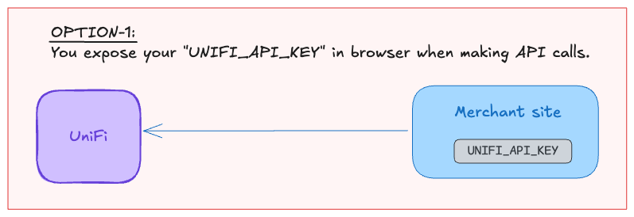
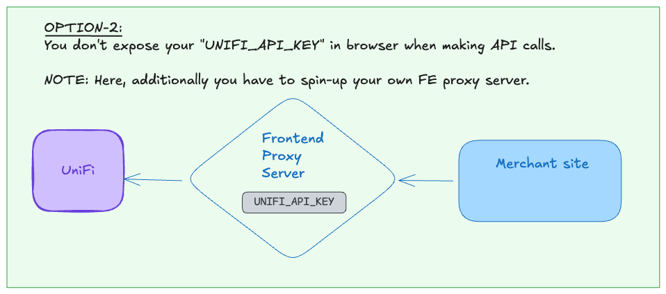

# FliQ Market

A simple marketplace using [UniFi](https://www.unifiweb3.com/) pay option (alongside Debit, Credit, UPI, ..) in its payment gateway.

## Merchant

In order to be a merchant, you have to [signup](https://unifiweb3.pages.dev/auth/signup) on [UniFi's web app](https://unifiweb3.pages.dev/home).

You can signup using either:

- Email
- Web3 wallet (Metamask).

And then, you need to create API key following this [doc](https://github.com/abhi3700/unifi-dev-kit/blob/main/api-http/README.md).

Once you have your API Key,

- <u>Development</u>: you can add as env variable (for testing) & run locally. But this is unsafe in production.

- <u>Production</u>: you can spin-up a Frontend proxy server allowing your merchant site to make UniFi API calls via FE Proxy server.


## Run

Setup needs to be done via `$ npm install`.

### Local

```sh
npm run dev
```

### Production

Try the marketplace: <https://fliqm.pages.dev/>
