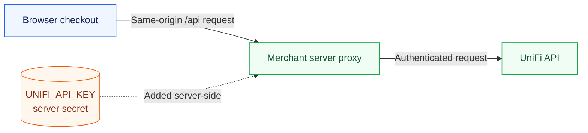

# FliQ Market

🛒 A lightweight marketplace demo showcasing **[UniFi](https://www.payunifi.com/)** as a seamless payment option — alongside 💳 Debit Card, 💳 Credit Card, and 🇮🇳 UPI — within a modern payment gateway.

<p align="left">
    
</p>

## Merchant

### Get your API Key

To become a merchant, sign up on the [UniFi Web App](https://payunifi.com/app) using the following link: \
👉 <https://payunifi.com/app/auth/signup>

You can sign up using either of the following methods:

- 📧 Email
- 🦊 Web3 Wallet (MetaMask)

Next, generate your **API Key** by following this [guide](https://github.com/abhi3700/unifi-dev-kit/blob/main/api-http/README.md).

Once your API Key is created, keep it in the merchant's server environment:

```makefile
UNIFI_API_KEY=
MERCHANT_WALLET_ADDRESS=
```

`UNIFI_API_BASE_URL` is an optional UniFi admin override for local, staging, or self-hosted API testing. `UNIFI_WEB_APP_BASE_URL` is an optional UniFi admin override for local checkout testing only. The widget library contains both production URLs, so merchants should omit both variables.

The browser never receives `UNIFI_API_KEY` or `UNIFI_API_BASE_URL`. It requests payment status through the merchant's same-origin `/api` route, and the server-side proxy adds the API key when calling UniFi. `/api/config` returns the public `MERCHANT_WALLET_ADDRESS` required to create the payment and, when configured, the non-secret local `UNIFI_WEB_APP_BASE_URL`.


```mermaid
flowchart LR
    Browser["Browser checkout"] -->|"Same-origin /api request"| Proxy["Merchant server proxy"]
    Secret[("UNIFI_API_KEY<br/>server secret")] -.->|"Added server-side"| Proxy
    Proxy -->|"Authenticated request"| UniFi["UniFi API"]

    classDef browser fill:#eff6ff,stroke:#2563eb,color:#172554
    classDef server fill:#f0fdf4,stroke:#16a34a,color:#14532d
    classDef secret fill:#fff7ed,stroke:#ea580c,color:#7c2d12
    class Browser browser
    class Proxy,UniFi server
    class Secret secret
```

- **Local admin testing with Vite:** Put `UNIFI_API_KEY`, `MERCHANT_WALLET_ADDRESS`, `UNIFI_API_BASE_URL`, and `UNIFI_WEB_APP_BASE_URL` in `.env.development.local`. The template contains the current local merchant wallet address.
- **Local admin testing with Cloudflare Pages:** Put all four values in `.dev.vars` and run `./local.sh`. Only the public wallet and non-secret web-app URL are returned through `/api/config`; the key is never returned.
- **Merchant production:** Configure `UNIFI_API_KEY` as an encrypted Cloudflare Pages secret and `MERCHANT_WALLET_ADDRESS` as a project variable. The widget uses its built-in production API and checkout URLs.

> [!CAUTION]
> Never prefix the API key with `VITE_`, `NEXT_PUBLIC_`, or another client-exposed prefix. Never commit `.env*` or `.dev.vars` files containing real credentials. Merchants should not override `UNIFI_API_BASE_URL` in production.

### Handle Payment Completion

After a successful payment, UniFi generates a **receipt_id** linked to the corresponding **session_id** used in the payment link.

UniFi currently does **not** persist the mapping between `session_id` and `receipt_id`. Therefore, as a merchant, you should store the generated `receipt_id` in your application database to:

- ✅ Verify successful payment completion.

    > ⚠️ Blockchain transactions require **network finality** before being considered fully confirmed.
    > For example, on Ethereum, finality typically takes ~12 minutes after the payment is submitted. This duration may vary across different blockchains.

- 📄 Maintain transaction records.
- 🔄 Reconcile orders or payment status later.

## Run

Install the dependencies:

```sh
npm install
```

`unifi-pay-widget` tracks the GitHub `main` branch for local integration testing. npm records the branch's resolved commit in `package-lock.json`; normal installs and production deployments continue to use that exact commit until the dependency is explicitly refreshed. `./local.sh` performs that refresh before building and starting the local Cloudflare preview.

For a formal release, prefer a release tag or commit instead of the moving branch:

```sh
npm install github:abhi3700/unifi-pay-widget#<tag-or-commit>
```

### Local

Both development modes use a server-side proxy; choose the one that matches the workflow you need.

#### Hot reloading

> Copy `.env.template` to `.env.development.local`, then set your API key. The template already contains the current local merchant wallet and the two local UniFi service URLs.

```sh
npm run dev
```

#### Run with proxy (function)

> Copy `.env.template` to `.dev.vars`, then set your API key. The template already contains the current local merchant wallet and the two local UniFi service URLs.

```sh
npm run build

# Run a Cloudflare worker locally.
npx wrangler pages dev dist --port 8788
```

OR

```sh
./local.sh
```

### Production

> [!CAUTION]
> Store `UNIFI_API_KEY` as an encrypted Cloudflare secret and set `MERCHANT_WALLET_ADDRESS` as a Cloudflare project variable. Do not put the API key in browser code or a client-exposed environment variable. Leave both URL overrides unset so the widget uses its production defaults.

---

Deployment uses the widget commit already recorded in `package-lock.json`; it does not silently pull a newer, untested `main` commit.

Steps:

1. Add `UNIFI_API_KEY` and `MERCHANT_WALLET_ADDRESS` to the “Variables and Secrets” section of your Cloudflare project (Workers & Pages).
2. Refresh the widget from `main` and test the complete checkout flow locally:

```sh
./local.sh
```

3. Stop the local preview after testing. If `package-lock.json` resolved the widget to a new commit, review and commit that lockfile change.
4. Deploy the tested dependency tree:

```sh
./deploy.sh
```

`deploy.sh` is equivalent to:

```sh
# Install the exact dependency versions recorded in package-lock.json.
npm ci

# Create dist/ from the tested widget commit.
npm run build

# Upload dist/ to the production branch.
# wrangler pages deploy <FOLDER_NAME> --project-name <PROJECT_NAME>
npx wrangler pages deploy dist --project-name fliqm --branch main
```

### 🚀 Live Demo

🛒 Experience **FliQ Market** in action:  
👉 <https://fliqm.pages.dev/>

🧪 Test payments using **Sepolia Testnet**.

⚡ Powered by UniFi Gasless Payments
