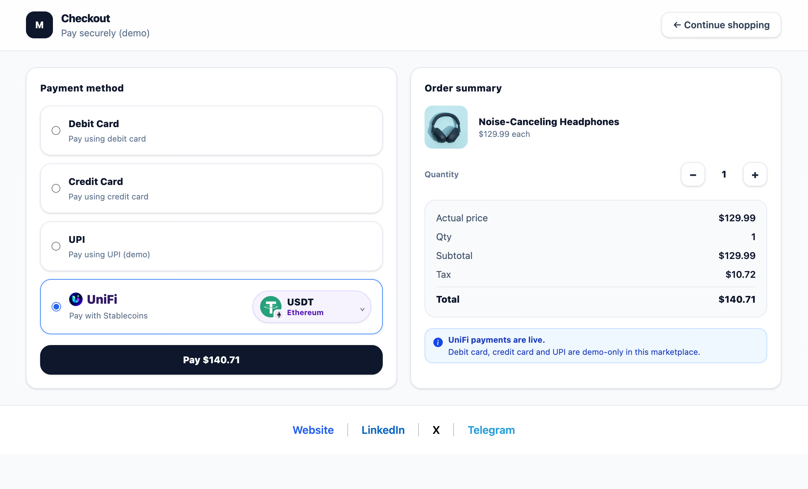
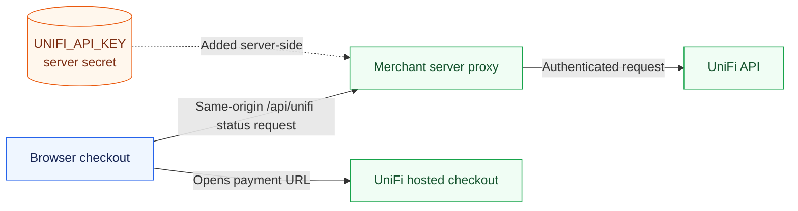

# FliQ Market

🛒 A lightweight marketplace demonstrating [UniFi Pay](https://payunifi.com/) alongside card and UPI payment options.

<p align="left">
    
</p>

This repository is an example integration of [`unifi-pay-widget`](https://github.com/abhi3700/unifi-pay-widget). The widget repository is the primary source for component APIs, security guidance, proxy setup, and payment lifecycle documentation.

## What this example demonstrates

- React payment components and styles from `unifi-pay-widget`;
- public merchant configuration from `/api/config`;
- payment-status requests through the same-origin `/api/unifi` proxy;
- a server-held UniFi API key that never enters the browser bundle;
- local Vite and Cloudflare Pages workflows.


```mermaid
flowchart LR
    Browser["Browser checkout"] -->|"Same-origin /api/unifi status request"| Proxy["Merchant server proxy"]
    Secret[("UNIFI_API_KEY<br/>server secret")] -.->|"Added server-side"| Proxy
    Proxy -->|"Authenticated request"| UniFi["UniFi API"]
    Browser -->|"Opens payment URL"| Checkout["UniFi hosted checkout"]

    classDef browser fill:#eff6ff,stroke:#2563eb,color:#172554
    classDef server fill:#f0fdf4,stroke:#16a34a,color:#14532d
    classDef secret fill:#fff7ed,stroke:#ea580c,color:#7c2d12
    class Browser browser
    class Proxy,UniFi,Checkout server
    class Secret secret
```

## Configuration

Both values are mandatory in production:

```makefile
UNIFI_API_KEY=
MERCHANT_WALLET_ADDRESS=
```

- Store `UNIFI_API_KEY` as an encrypted server or Cloudflare secret.
- Store `MERCHANT_WALLET_ADDRESS` as a Cloudflare project variable. It is public configuration returned by `/api/config` and passed to the widget as the payment recipient.
- Never expose the API key through `VITE_*`, `NEXT_PUBLIC_*`, or another client-visible variable.

`UNIFI_API_BASE_URL` and `UNIFI_WEB_APP_BASE_URL` are optional local/admin overrides. Leave both unset in merchant production so the widget uses its built-in production URLs.

## Run locally

Install dependencies:

```sh
npm install
```

The project tracks `unifi-pay-widget#main`. npm records the resolved commit in `package-lock.json`.

### Vite hot reload

Copy `.env.template` to `.env.development.local`, set the required values, and run:

```sh
./dev.sh
```

`dev.sh` refreshes the widget from `main` and starts the Vite development server with hot reload using `.env.development.local`.

### Cloudflare Pages preview

Copy `.env.template` to `.dev.vars`, set the required values, and run:

```sh
./local.sh
```

`local.sh` refreshes the widget from `main`, builds the app, and starts Wrangler on port `8788`.

## Payment completion

UniFi temporarily stores the `session_id → receipt_id` mapping in Redis for two hours so the widget can check payment status. That mapping is not a durable merchant order record. Persist the order, session ID, and confirmed receipt ID in the merchant database, and fulfill only after trusted server-side confirmation.

## Deploy to Cloudflare Pages

1. Configure `UNIFI_API_KEY` and `MERCHANT_WALLET_ADDRESS` in the Cloudflare project's Variables and Secrets.
2. Run `./local.sh`, exercise the checkout flow, and stop the preview.
3. Review and commit `package-lock.json` if `main` resolved to a newer widget commit.
4. Deploy the tested dependency tree:

```sh
./deploy.sh
```

`deploy.sh` runs `npm ci`, builds `dist/`, and uploads it to the `main` branch of the `fliqm` Cloudflare Pages project. It intentionally deploys the widget commit recorded in the lockfile instead of silently resolving a different commit.

## Live demo

- 🛒 <https://fliqm.pages.dev/>
- 🧪 Test payments using **Sepolia Testnet**.
